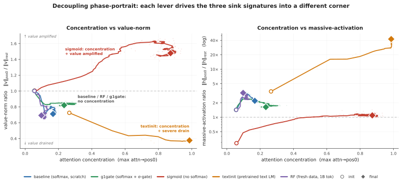
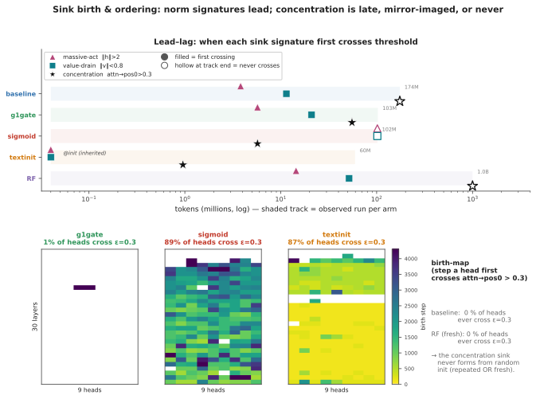
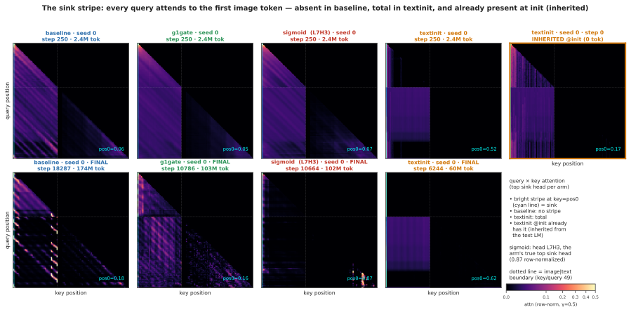
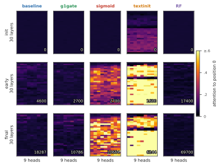
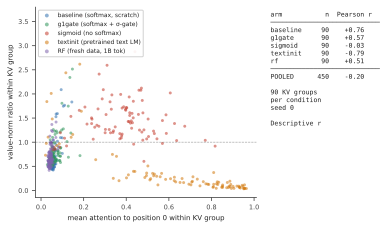
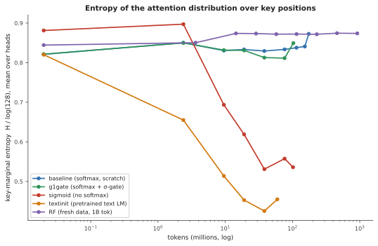

# Attention-Sink Signatures Dissociate During Vision–Language Pretraining

*Samvat Tiwari — *

---

Abstract. Hallucination is one of the most pressing limitations of large language models, and in vision–language models it is more rampant still. No clean solution has emerged, but several measurable symptoms track it. Attention sinks are among the most studied: positions that absorb a disproportionate share of attention regardless of content, repeatedly linked to hallucination in deployed VLMs, and partially mitigated with verifiable gains. In text language models the sink is well characterised, and it carries three signatures that co-occur so reliably they are usually treated as facets of a single phenomenon: attention concentration (Sink^ε_1, per query head), a near-zero value-norm at the attended token (v-ratio, per KV head), and an outsized residual-stream norm at that position (h-ratio, per layer), which we read as a massive-activation proxy rather than a channel-level measurement of massive activations. In vision–language models the picture is far less settled.

We study how those three signatures emerge in a 222M-parameter VLM: a SigLIP-B/16 encoder feeding a randomly initialized SmolLM2-135M-architecture decoder, where position 0 is the first image token and there is no BOS. We train it under four levers: standard softmax attention, output-gated softmax, unnormalized sigmoid attention, and decoder initialization from a pretrained text LM. The encoder is pretrained in every arm, so this is vision–language pretraining with randomly initialized decoders, not fully from-scratch training. Logging all three signatures separately throughout training, we find they come apart. Across n = 2–3 seeds per arm the four levers land in four distinct corners of the three-signature space, and no two arms share a signature triple; the value-norm axis alone is strongly drained, mildly drained, or amplified, and which of the three occurs differs by lever. On a low-repetition run over one billion fresh tokens (2.39 effective visual epochs, with a held-out loss that stays stable through the full billion tokens), the massive-activation proxy more than doubles while attention concentration stays at exactly zero. The per-head relationship between concentration and value-norm flips sign from one arm to the next, so no consistent-sign relationship holds across arms.

Prior text-only work separates massive activations from attention sinks. We add dense, joint tracking of all three signatures under randomly initialized decoders in the multimodal setting, and show that all three, value-norm drain included, respond separately to ordinary training-time choices. Whether that dissociation predicts grounding or hallucination behaviour we do not test here; we establish when and how each signature forms, which is the step that comes first.

---

# 1. Introduction

Decoder-only transformers learn a habit early in training. They send a large share of
attention to the first token or tokens of a sequence, whatever those tokens contain. The
habit has practical weight. Streaming inference methods depend on it [1]. The extreme
activation outliers that come with it make quantization harder [2]. A survey now organizes
a subfield around how to interpret the habit and how to remove it [3].

In text language models the sink does not arrive alone. Three measurements move together.
Attention concentrates on the sink token. The value vector at that token drops to a
near-zero norm, which the literature calls value-state drain [4]. The residual stream at
that token grows an abnormally large norm, which the literature calls a massive activation
[2, 5]. Gu et al. [6] report that these effects settle on the same few tokens.
Queipo-de-Llano, Arroyo et al. [7] report that they appear early in training, near step
1000. This regular co-occurrence has led the field to treat the three signatures as facets
of one attention-sink phenomenon.

The field disputes whether they really are one phenomenon. One line of work argues for
causal unity. Massive activations in the residual stream mathematically require
representational compression. Ablation of those activations removes both compression
valleys and sink formation [7]. A related view holds that outlier-driven rescaling by
attention and residual sinks is *essential* to stable transformer training [8]. Two recent
text-only studies pull the other way. Each separates a pair of these signatures by
intervention. A change of normalization scheme crushes the massive-activation spike, and
the sink ratio survives [9]. A value-scale intervention in from-scratch text language models
keeps the sink and suppresses massive activations [10]. Both results are text-only. Each one
separates at most two of the three signatures.

Vision–language models make a sharp instrument for this question, for two reasons. First,
the multimodal setting changes what position 0 *is*. Our sequence starts with 49 image
tokens and has no BOS token. The candidate sink token is therefore a visual token. It has
none of the special-token machinery that text-LM sink accounts use. Second, the multimodal
sink studies we know analyze mostly frozen, already-trained backbones at inference time
[11, 12]. They show that vision-side and language-side sinks have different origins. Luo et
al. [11] do track sink-dimension magnitudes across alignment checkpoints, with a frozen
vision transformer and a pretrained language model. A reader still cannot see, in that
setting, whether the three signatures arrive together, in sequence, or independently while
they form in a decoder that starts from random weights. That requires pretraining with a
randomly initialized decoder and all three signatures logged separately from step 0.

The question also carries deployment stakes. Attention allocation is the mechanism that
connects the language a vision–language model generates to the content of the image. A sink
is a measurable failure mode of *where* that allocation goes. A growing literature ties
these same signatures to hallucination in deployed vision–language models. Visual attention
sinks absorb attention, massive activation of specific hidden dimensions drives them, and
redistribution methods recover the absorbed attention [13]. Hallucination errors cluster in
the decoding steps immediately after the model generates a sink token, which motivates
sink-aware decoding [14]. One paper proposes a causal chain from positional encoding
through massive activations to visual sinks and then to hallucination [15]. In text
language models, sink attention together with value-norm structure carries enough signal to
detect hallucinations [16]. All of that work probes or intervenes on models that are
already trained. The question underneath it is when these signatures form during training,
and whether they form as one thing or as several. This paper answers that question. We do
not measure whether their dissociation predicts grounding or hallucination behavior. This
paper establishes the training-dynamics precondition.

We work at deliberately small scale. The model is a 222M-parameter nanoVLM [17]. A
pretrained SigLIP-B/16 encoder [18] feeds a randomly initialized decoder with the
SmolLM2-135M architecture [19]. We train it under four levers. Each lever targets one
sink-relevant mechanism. *baseline* uses standard softmax attention. *g1gate* adds a
Qiu-style G1 output gate in our zero-initialized variant, an elementwise gate on attention
output, which removes both the sink and massive activations in text language models [20].
*sigmoid* replaces softmax with unnormalized sigmoid attention. That removes the
normalization from which sinks are argued to come [6]. *textinit* initializes the decoder
from the pretrained SmolLM2 text language model, and thus imports whatever sink structure
text pretraining built. A validated probe logs concentration per query head, value-norm
ratio per KV head, and the residual-norm ratio per layer, every 100 steps. The four-arm
comparison reuses a small image pool; we therefore re-test the central negative result
under low repetition, on a fresh stream of one billion tokens (*RF*, 2.39 effective visual
epochs).

**Contributions.**

1. **Four levers, four corners (n = 2–3 seeds/arm).** The four arms reach four different
   corners of the three-signature space. No two arms
   share a signature triple. The value-norm ratio alone moves in three qualitatively
   different directions, strongly drained or mildly drained or amplified, and which one
   occurs differs by
   lever (Fig. 1, Table 2). The four arms are not a factorial design, so we report distinct
   intervention-associated profiles, not isolated causal effects.
2. **Low-repetition decoupling at 1B tokens (n = 1).** On a fresh stream at 2.39 effective
   visual epochs, with a held-out loss that never turns upward, the massive-activation
   proxy rises from an
   h-ratio of 1.43 to 3.22, about 2.3×, across a full billion tokens. Attention
   concentration stays at exactly zero for the entire single-seed run. No head ever crosses
   the sink threshold (§3.2, §5).
3. **No consistent-sign head-level relationship.** The per-head correlation between
   concentration and value-norm flips sign across arms (+0.76 baseline → −0.79 textinit,
   pooled −0.20, over 90 KV groups per arm). We report these descriptively (§3.3).

Text-only work already separates massive activations from concentration through
normalization [9] and value-path [10] interventions. Decoupling by itself is therefore not
new, and we do not claim it. The new part is the conjunction: dense, joint tracking of all
three signatures under randomly initialized decoders in a multimodal model, with value-norm
drain as a third axis that moves on its own.

---

# 2. Setup

**Model and token layout.** All runs use a 222M-parameter nanoVLM [17]. A pretrained,
trainable SigLIP-B/16 vision encoder [18] feeds a decoder with the SmolLM2-135M
architecture [19] through a learned modality projector. The decoder has 30 layers of
grouped-query attention, with 9 query heads per layer sharing 3 KV heads, so it has 270
(layer, query-head) pairs but only 90 (layer, KV-group) value projections, a distinction
that matters in §3.3. The decoder trains **from random initialization** in every arm except
*textinit*, because the point is to watch the signatures form. Each sequence holds 49 image
tokens as a causal prefix, then 79 left-padded text tokens, for 128 tokens in all.
**Position 0 is the first image token, and there is no BOS token.** What happens at position
0 is therefore a property of the visual prefix in the arms with a randomly initialized
decoder, not of inherited BOS machinery. *textinit* is the exception by design: it imports
first-position structure from text pretraining, and shows a sink before any multimodal step
(§3.1).

**Arms.** We use four training levers. Each lever targets one sink-relevant mechanism.
Everything else stays byte-identical across arms.

| arm | attention | LM init | ViT init | lever precedent |
|---|---|---|---|---|
| *baseline* | softmax | random | pretrained | — |
| *g1gate* | softmax + elementwise σ-gate (zero-init, post-SDPA) | random | pretrained | G1 gating [20] |
| *sigmoid* | unnormalized sigmoid, no softmax | random | pretrained | Gu et al. [6] |
| *textinit* | softmax | pretrained SmolLM2-135M | pretrained | — (novel control) |

The *g1gate* and *sigmoid* levers have established sink effects in text-only models [20, 6].
The *textinit* lever has no precedent in the sink literature. It works as an inheritance
control, importing whatever sink structure text pretraining already built into SmolLM2.

**A scale confound in our gate variant.** Qiu et al. [20] use ordinary initialization for
the G1 gate. We initialize the gate parameters at exactly zero, so the sigmoid opens at
σ(0) = 0.5 at step 0. Our gated arm therefore begins as a half-scale attention-output
intervention as well as a gating one, and the two effects are not separated here. We call
the arm **Qiu-style G1 in our zero-initialized variant** throughout, and any comparison to
the published G1 result carries that caveat (§5).

**Data and the two training regimes.** The four-arm comparison trains on four curated
subsets of `the_cauldron` [21], about 146K images, matched at about 100M tokens per arm.
*textinit* stops at 60M tokens, where its signatures have plateaued (§3.1). Reuse of that
pool gives high visual-epoch counts, so a reader could treat a "no sink emerges" result as
an overfitting artifact. The **RF** arm (random-fresh) answers that objection. It re-trains
the *baseline* recipe on a fresh FineVision stream [22] to 1B tokens, over about 4.6M
natural images, at **2.39 effective visual epochs**. RF is therefore a **low-repetition**
run, not a repetition-free one: examples do repeat, about 2.4 times on average. A change of
dataset also trades the repetition confound for a domain-shift confound. We accept that
trade and document it. We estimate the overlap between the fresh pool and the repeated
subsets at under 3%, from the config-level composition of the two pools. We did not run
image-level deduplication, so that number is an estimate and not measured evidence. We did
not run a third, domain-matched control (§5).

**Three signatures, tracked separately.** We log the three sink symptoms that the text-LM
literature reports together, each at its own granularity, following Gu et al. [6] at a
fixed sequence length. The decoder has *L* = 30 layers, *H* = 9 query heads per layer, and
*G* = 3 KV heads per layer. Every quantity below is averaged over valid query positions and
over the fixed probe batch.

*Concentration* (Sink^ε_1) is the fraction of the *L·H* = 270 (layer, query-head) pairs
whose mean attention to position 0 exceeds ε. We use the ε = 0.3 default of [6] and check
ε ∈ {0.2, 0.4}. Cross-arm tables report the stricter ε = 0.2, which makes an absence claim
harder to pass.

*Value-norm ratio* (v-ratio) is the value norm at position 0 divided by the mean value norm
over the other valid positions, computed per layer and then averaged over the 30 layers.
Below 1 is value-drain [4]; above 1 is amplification. Under grouped-query attention a value
vector belongs to a KV group and repeats across 3 query heads, so the ratio rests on
*L·G* = 90 independent value projections, not 270. This matters for §3.3.

*Residual-norm ratio* (h-ratio) is the residual-stream norm at position 0 divided by the
mean norm over the other positions, again per layer and then averaged over the 30 layers.
We call it a **massive-activation proxy**. Massive activations are normally defined by
channel-level outliers [2, 5], which we never measured; the h-ratio captures a
position-specific residual-norm asymmetry, necessary but not sufficient for that definition.

All three metrics **anchor on position 0 by construction**. We state this as a measurement
choice, and we check it: at seed 0, per-position attention mass makes position 0 the
maximum-mass token in every arm (Appendix C). Section 5 handles the remaining seed-level
caveat. The *sigmoid* arm reports the row-normalized attention view, which keeps
concentration comparable across arms, and we also log the raw sigmoid mass (Appendix D).

**Why a sink is expected at all.** Softmax forces every attention row to sum to one. A head
with nothing informative to retrieve must still place its mass somewhere. Gu et al. [6]
argue that the sink token absorbs that surplus and acts "more like key biases." That
sum-to-one constraint is the standing mechanism against which our *sigmoid* arm, which
removes normalization, is the direct test.

**Probe.** The function `probe_sinks()` re-walks the decoder from the live module weights in
eager mode, in fp32, with no gradients, independent of the training path, which uses fused
SDPA kernels, autocast, and `torch.compile`. Every call validates its hidden states against
the real forward pass, to a relative error below 10−2, so the probe cannot drift
from what the trained model computes. The probe batch stays fixed across all runs and seeds,
so every number here is comparable from run to run, and probes fire every 100 optimizer
steps, dense enough to timestamp each signature's first threshold crossing (§3.4). Appendix
F gives the probe-batch composition, the token accounting, and the validation protocol.

**Recipe.** We use AdamW with weight decay 0.1, following [6], and a gradient clip of 1.0.
The schedule is cosine with 3% warmup. The learning rates are 4 × 10−4 for the
language model, 2 × 10−3 for the projector, and 10−4 for the vision
encoder. We use bf16 autocast, `torch.compile`, and a batch size of 128. Arms in a
comparison differ only in the lever under test. We use two seeds for *baseline* and
*sigmoid*, three for *g1gate* and *textinit*, and one for *RF*.

**Validation losses, and what they do and do not license.** Training stays healthy in all
reported runs. At the matched 100M-token checkpoint the held-out losses are 1.182 for
*baseline*, 1.133 for *g1gate*, 1.206 for *sigmoid*, and 0.877 for *textinit*, and RF
reaches 0.638 at 1B tokens (Appendix F). Two cautions. *textinit* starts from a pretrained
text decoder, so its lower loss reflects unequal competence rather than a lever effect, and
only *baseline*, *g1gate*, and *sigmoid* are equal-token, equal-initialization comparisons.
The repeated-data arms also show a large train–validation asymmetry (`val_seen` near 0.44
against `val_unseen` near 1.18), which is the overfitting signal that motivates RF. RF has
no distinct seen split and cannot be checked the same way, so the weaker statement its data
supports is that its held-out loss falls throughout and never turns upward. **We did not run
MMStar or any other downstream benchmark on any arm**, so this paper makes no capability
claim (§5).

---

# 3. Results

<figure id="fig1">

<figcaption><b>Figure 1: Decoupling phase-portrait.</b> Training trajectories of every arm
in concentration-against-value-norm space, at left, and concentration against the
residual-norm ratio, at right, on a log scale. Circles mark initialization. Diamonds mark
the final checkpoint, at about 100M tokens for <em>baseline</em>, <em>g1gate</em> and
<em>sigmoid</em>, 60M for <em>textinit</em>, and 1B for <em>RF</em>; seed 0 unless a seed is
labelled. <b>Note the metric difference from the tables:</b> the horizontal axis is the
<em>maximum</em> attention→pos0 over heads, a continuous quantity that keeps a trajectory
visible, whereas Table 1 reports Sinkε1, the <em>fraction of query
heads above a threshold</em>. An arm can therefore sit at a non-zero position on this axis
while its Sinkε stays 0.000. Paths are smoothed (Appendix D); faint dots are the
unsmoothed per-probe values, and the end markers use raw values. Each lever drives the
signatures to a different corner, and every combination of directions occurs. If the three
signatures were one phenomenon, these trajectories would move together along one
direction.</figcaption>
</figure>

## 3.1 Four training levers reach four different signature corners

Table 1 collapses the seeds into per-arm ranges, over two seeds for *baseline* and
*sigmoid* and three for *g1gate* and *textinit*. Appendix B gives the full per-seed table.
Each arm is read at its final matched checkpoint: about 100M tokens for baseline, g1gate,
and sigmoid, and 60M tokens for *textinit*, whose signatures have plateaued by then.
**No two arms share a signature triple.**

**Table 1 — the four corners (n = 2–3 seeds per arm).** Concentration is Sink^0.2, the
fraction of the 270 (layer, query-head) pairs whose mean attention→pos0 exceeds 0.2. The
v-ratio rests on 90 (layer, KV-head) value projections and the h-ratio on 30 layers (§2).

| arm | concentration | value-norm | massive-activation proxy |
|---|---|---|---|
| baseline | absent (0.000) | mild drain (0.69–0.72) | moderate (1.7–2.2) |
| g1gate | near-absent (0.004–0.011) | **milder drain** (0.81–0.85) | moderate (1.7–2.2) |
| sigmoid | strong (0.76–0.83) | **amplified** (1.48–1.60) | no strong asymmetry (1.1–1.3) |
| textinit | strong (0.56–0.85) | strong drain (0.38–0.63) | extreme (5.5–42.5) |

The value-norm axis alone takes three qualitatively different directions. The lever drains
it hard, drains it only mildly, or amplifies it above 1. No arm leaves it unchanged.

The corners separate pairwise on single axes. *g1gate* differs from *baseline* on the
value-norm axis alone: concentration is absent or near-absent and the residual-norm ratio
moderate in both, while the gate makes the baseline's mild value-drain milder still, from
0.69–0.72 to 0.81–0.85, a 15–19% drain rather than none. *sigmoid* and *textinit* both reach
strong concentration and then part on two axes, the *direction* of the value-norm move and
the residual-norm ratio. Each arm shows a distinct intervention-associated profile. The four
arms are not a factorial design, so we do not attribute these profiles to isolated causal
effects of single levers. Figure 1 shows the trajectories separating early and ending in
four corners. They do not share one origin: *textinit* starts from a pretrained text decoder
and therefore begins with an inherited sink in place.

Reproducibility differs by arm. *g1gate* is the tightest, at Sink^0.2 of 0.004, 0.011, and
0.0037 across three seeds. The corner of *textinit* repeats across seeds, and its
magnitudes do not: seed 0 sits far above the other two on every signature at once, at
h-ratio 42.5 against 5.5–12.2 (Appendix B). Part of that spread is positional, because at
seeds 1 and 2 the arm's peak signatures move off position 0, where our metrics anchor
(§3.4). We therefore report the massive-activation proxy of textinit as a **range
(5.5–42.5×) with a median near 12×** everywhere in this paper, and we treat the corner as
the reproducible claim rather than any particular magnitude.

## 3.2 The massive-activation proxy grows across 1B low-repetition tokens while concentration stays at zero

The four-arm comparison reuses a 146K-image pool, so a reader could read its "concentration
never emerges" result as an overfitting artifact. The RF arm addresses that: the identical
*baseline* recipe on a fresh FineVision stream to one billion tokens, at **2.39 effective
visual epochs**. Examples still repeat, about 2.4 times on average, so this is a
**low-repetition** run rather than a repetition-free one. Its held-out loss falls through
the full billion tokens and never turns upward, so nothing in the run indicates overfitting.
RF has no distinct seen split, so we cannot repeat for it the `val_seen` / `val_unseen`
comparison that exposes memorization in the repeated arms (§2, §5).

Concentration never arrives. **Sink^0.3 = 0.000 across the entire 0 → 1B run.** No head of
the 270 crosses the sink threshold, at any of about 700 probes. The massive-activation
proxy, in the same run, keeps growing far past warmup.

**Table 2 — RF (fresh stream, 2.39 visual epochs, n = 1 seed), init → 1B tokens.**

| signature | @ init | @ 1B | net |
|---|---|---|---|
| Sink^0.3 (concentration) | 0.000 | 0.000 | flat zero, entire run |
| max attn→pos0 | 0.056 | 0.098 | ≈flat, far below threshold |
| h-ratio (massive-activation proxy) | 1.43 | **3.22** | **≈2.3×**, positive long-horizon trend |
| v-ratio (value-norm) | 1.00 | 0.69 | net drain, non-monotone |

Warmup does not explain the rise. The h-ratio climbs from 2.40 at about 57M tokens to 3.22
at 1B, long after the 3% warmup window closes, though not monotonically at probe resolution,
so we report it as a positive long-horizon trend. In Figure 1, at right, the violet
trajectory climbs and never moves rightward. The v-ratio ends below its initialization
value, but about 75% of that drop happens in the first 57M tokens and it then recovers part
of it, so we report it as supporting context rather than ongoing emergence. **The massive-activation proxy grows about 2.3× across a full billion tokens of
multimodal training while attention concentration never leaves zero (n = 1 seed; §5).**

## 3.3 No consistent-sign head-level relationship between concentration and value-norm

A tight coupling between concentration and value-drain should at minimum hold the sign of
their per-head correlation constant across training regimes. It does not. Table 3 reports
the Pearson r between attention→pos0 and value-norm ratio at the final checkpoint of each
arm, over the 90 (layer, KV-group) observations: under grouped-query attention a value
vector is shared by 3 query heads, so we average the attention of a group's query heads
rather than triplicate its value observation (§2). Appendix Fig. A2 plots the scatter.

**Table 3 — r(attn→pos0, v-ratio), final checkpoint. Descriptive only; we report no
p-values, for the reason given below.**

| baseline | g1gate | sigmoid | textinit | RF | pooled |
|---|---|---|---|---|---|
| +0.76 | +0.57 | −0.04 | −0.79 | +0.51 | −0.20 |

These correlations are **descriptive statistics, not inferential ones**, and we deliberately
report no significance tests: heads within a layer are not independent, and each arm rests
on a single seed at this checkpoint, so a p-value would mislead. Collapsing to the 90 KV
groups removes the pseudoreplication a per-query-head reading would introduce and leaves the
picture unchanged (Appendix D).

The pattern is about **sign**, which the pseudoreplication does not manufacture. Heads that
attend more to position 0 have *larger* value norms in the baseline regime and *smaller*
value norms under text initialization. The pooled correlation is weak only because arms of
opposite sign cancel, and it is not an uncorrelated cloud. We therefore claim no
consistent-sign relationship across arms. We do not claim the absence of a coupling law: a
fixed coupling would have to show one sign everywhere, and it does not.

## 3.4 Ordering: norm signatures lead, and concentration is late, mirrored, or absent

<figure id="fig2">

<figcaption><b>Figure 2: Sink birth and ordering.</b> Seed 0 throughout. <em>Top:</em> a
time-to-event view. Each shaded track spans the tokens for which we observed that arm, from
60M to 1B. A filled marker shows the first probe at which a signature crossed its per-head
threshold: residual-norm ratio h&gt;2, value-drain v&lt;0.8, concentration
attn→pos0&gt;0.3. A hollow marker at the end of a track means that the signature never
crossed inside the observed run. <b>All crossing times are interval-censored</b> at the
100-step probe cadence: a reported birth step means "the first probe at which the threshold
had already been crossed". Two signatures that cross within one interval of each other
should not be read as ordered. <em>Bottom:</em> birth-maps, which show the step at which
each (layer, query-head) pair first crosses the concentration threshold. No baseline head
and no RF head ever crosses. 1% of g1gate heads cross, against 89% for sigmoid and 87% for
textinit.</figcaption>
</figure>

Dense probing lets us timestamp the arrival of each signature (Figure 2), and the ordering
stays consistent inside each arm family. In the softmax arms with randomly initialized
decoders, *baseline* and *g1gate* and *RF*, the norm signatures come early. The
residual-norm ratio crosses its per-head threshold within the first few to about 15M
tokens, and value-drain follows within about 50M tokens. Concentration never comes. No
baseline head and no RF head crosses the concentration threshold at any point in training,
and g1gate reaches 1% of heads, a single-layer blip late in training. *sigmoid* mirrors that
pattern: its concentration crosses early, at about 6M tokens, and 89% of its heads cross
eventually, while neither norm signature ever crosses. *textinit* inherits its norm
signatures rather than grows them. Value-drain and an elevated residual-norm ratio are both
present at 0 tokens, imported with the pretrained text-LM weights. Concentration is *not*
inherited the same way: Sink^0.3 is 0.000 at step 0 and crosses before 1M tokens. Even in
the arm that imports the most sink structure, the norm signatures precede concentration.

<figure id="fig3">

<figcaption><b>Figure 3: The sink stripe.</b> Query &times; key attention of the top sink
head of each arm, row-normalized, at seed 0; every panel is labelled with its seed, step and
token count. The top row is early in training (step 250, about 2.4M tokens). The bottom row
is the final checkpoint. The cyan line marks key = pos0 and the dotted line the
image-to-text boundary. The pos0 stripe is <em>absent</em> in baseline throughout, and
strong in textinit, which reaches attn→pos0 = 0.62 at its final checkpoint. The rightmost
panel shows the stripe <em>already present at step 0</em> in textinit, inherited from the
text language model. The <em>sigmoid</em> column uses head <b>L7H3</b> (0-indexed), the
arm's top sink head on the fixed probe batch at 0.87 row-normalized attention to pos0; its
heat maps are re-rendered from an auxiliary streaming batch, while every printed sigmoid
number comes from the fixed probe batch (Appendix D).</figcaption>
</figure>

Figure 3 shows the same result at the level of a single head, through the query × key
attention map of the top sink head of each arm. The vertical stripe at key = pos0 marks
every query attending to the first image token. That stripe is absent in *baseline* at both
checkpoints and strong in *textinit*. The rightmost panel carries the most weight. **The
stripe is already there at step 0 in textinit**, imported with the text-LM weights before
the model has seen one image.

The *sigmoid* arm needs one measurement note, because row-normalization changes the object
being measured and Gu et al. [6] state their result for *unnormalized* sigmoid attention.
The concentration this arm develops is a **relative** reallocation of a shrinking gate
budget onto position 0, not the growth of a large absolute mass there. Appendix D gives the
raw and row-normalized values behind that reading. We report the row-normalized view in the
tables so the arms stay comparable.

Attention-entropy collapse, which the text-LM literature uses as the usual correlate of
concentration, separates the same way. Only *sigmoid* and *textinit* collapse (Appendix
Fig. A3). Entropy collapse tracks the concentration axis, not the norm axes.

**The signatures also dissociate in position.** A per-position scan across all three
*textinit* seeds shows that the three signatures need not share a token. They coincide at
position 0 at seed 0; at seed 1 the attention maximum stays at position 0 while the residual
peak moves to pos1 and the value minimum to pos5; at seed 2 they separate furthest, with
attention at **pos1** and both norm extrema at **pos13** (Appendix C). The arms with
randomly initialized decoders behave differently. Position 0 remains the maximum-mass token
in *baseline*, *g1gate*, and *sigmoid* at every seed we scanned, and in *RF* the attention
argmax sits at pos1 with mass 0.100 against 0.083 at position 0, a diffuse profile rather
than a concentration sink.

We report this as a supporting observation, not a second headline. It carries one
consequence for measurement: because all three metrics anchor on position 0, the *textinit*
magnitudes at seeds 1 and 2 are read at a token that is no longer the peak and therefore
**understate** the arm's true peaks. That is a further reason to report *textinit* as a
range and a median (§3.1, §5). The anchoring holds for the arms with randomly initialized
decoders, which carry the central negative result.

Appendix E sets out, as untested hypotheses, how each lever might touch the sum-to-one
mechanism of Gu et al. [6] and thereby move a different axis. Nothing in this paper tests
them.

---

# 4. Related Work

**Attention sinks and their companions in text language models.** Gu et al. [6] give the
canonical empirical account. The sink token acts "more like key biases, storing extra
attention scores, which could be non-informative and not contribute to the value
computation." They report small key and value norms at the sink as part of the same
phenomenon, and they connect the sink to massive residual-stream activations [2, 5]. They
also show that unnormalized sigmoid attention prevents sink formation in text language
models up to 1B parameters. Our *sigmoid* arm builds on that result. Guo et al. [4]
describe the coupling between concentration and value-drain as "active-dormant" heads,
where the model actively drives the value state of the sink head toward zero.
Queipo-de-Llano, Arroyo et al. [7] make the strongest unity claim, and the only genuinely
*causal* one. Massive activations mathematically require representational compression, and
ablation of the layer-0 massive activation of a model removes both compression valleys and
sink formation. Across Pythia checkpoints they find that sinks, compression valleys, and
massive activations appear together near step 1000 and then stay synchronized. We reserve
the term "causally unified" for that result alone. Peng et al. [24] trace a first-position
sink circuit that emerges early in from-scratch text pretraining. That work covers
from-scratch emergence dynamics, in text only, and does not separate the signatures.

**Prior decoupling results: text-only, two axes.** Two recent papers already separate pairs
of these signatures in text models, and we scope our claim around them. Sun, Canziani,
LeCun and Zhu [9] show that massive activations and attention sinks are dissociable
architectural artifacts. A change of normalization scheme crushes the massive-activation
spike, and the sink ratio survives. That is a two-way dissociation, in text only, through a
normalization lever, on trained checkpoints. Chen and Yao [10] decouple the same pair from
the opposite direction and from scratch. In text language models of 0.1–0.3B parameters,
probed at dense checkpoints, a value-scale intervention keeps the sinks and suppresses
massive activations. Neither paper treats value-norm drain as a third axis that moves on
its own. Neither paper is multimodal. Fesser et al. [23] come at the same question from
another direction, and their result is the closest external support for tracking the value
norm separately: they argue that one sink pattern can hide two different algorithms, an
"adaptive nop" (a no-op: the head suppresses its own update by routing to a null token)
and a "broadcast" that
aggregates and redistributes global information, and that the two leave different traces —
nop sinks show negligible value norms, broadcast sinks produce low-rank outputs. On their
account gating implicitly assumes the nop mechanism and registers implicitly assume
broadcast. That work is on vision transformers rather than vision–language models, and it
diagnoses trained models rather than tracking emergence, but it independently motivates
treating the value norm as diagnostic rather than decorative. On the opposite side of the
argument, Qiu et al. [8] hold that outlier-driven rescaling by attention and residual sinks
is essential to stable training. The field is unsettled on two counts. It disputes whether these signatures
separate, and it disputes whether anyone should remove them at all.

**Multimodal sinks: mostly frozen backbones, inference time.** Luo et al. [11] identify
high-norm attention-sink tokens that originate in the vision transformer, and they separate
ViT-propagated sinks from LLM-emerged sinks. Their Appendix A.4 does track sink-dimension
magnitudes across alignment checkpoints, so a training-time view of multimodal sinks is not
without precedent; that view uses a frozen vision transformer and a pretrained language
model, and follows sink-dimension magnitude rather than the three signatures separately.
Choi et al. [12] likewise distinguish vision-sinks from language-sinks in a frozen large
vision–language model and gate them by layer. Both papers establish that multimodal sinks
have distinct vision-side and language-side origins, and our *textinit* inheritance result
fits that frame naturally. What is not yet available in that literature is dense, joint
tracking of concentration, value-norm and residual-norm as separate quantities in a decoder
that starts from random weights. Vision transformers also grow high-norm "register" tokens
of their own [25], which is why the pretrained encoder gets its own limitation in §5.

**Sinks and hallucination in deployed vision–language models.** A parallel line of work
ties these signatures to grounding failure. Kang et al. [13] attribute *visual* attention
sinks to massive activation of specific hidden dimensions, and they redistribute the
absorbed attention to reduce hallucination. Shukla and Kira [14] report that hallucination
errors concentrate within a few decoding steps of the generation of a sink token. They then
decode in a sink-aware way. Zhang et al. [15] trace a causal chain from rotary position
encoding through massive activations to visual sinks and then to hallucination. In text
language models, Binkowski et al. [16] detect hallucinations from sink structure. Their
classifier relies preferentially on sinks whose value vectors have large norms, which makes
it the closest precedent for treating value norms as a signal. All four papers work on
models that are already trained, at inference time. Kang et al. [13] and Zhang et al. [15]
both treat massive activation and concentration as one coupled mechanism; Shukla and Kira
[14] work at the level of sink tokens and grounding rather than massive activations, and
[16] is text-only as well. None of them tracks
the signatures across training. None of them treats value-norm drain as a third axis that
moves on its own. Our result is the training-dynamics complement to that line. The coupling
on which the line depends is lever-dependent, not fixed.

**The gating lever.** Qiu et al. [20] introduce the head-specific elementwise sigmoid gate on
attention output that our *g1gate* arm adapts. In text language models the gate "largely
reduces the attention score allocated to the first token and decreases massive activations"
while it improves quality. Our variant differs in one way that matters: Qiu et al. use
ordinary initialization, and we initialize the gate at exactly zero, so it opens at
σ(0) = 0.5 and applies a half-scale factor to attention output at step 0 (§2). Our arm is
therefore **Qiu-style G1 in a zero-initialized variant**, and gating and initial scaling are
confounded in it. With that caveat, what we observe in the multimodal setting with a
randomly initialized decoder is that concentration is already absent in the baseline, so the
axis on which our gated arm differs from baseline is the value-norm axis: the drain becomes
milder, from a v-ratio of 0.69–0.72 to 0.81–0.85, rather than being removed. The
residual-norm ratio is comparable in the two arms. That difference stays invisible unless
the three signatures are logged separately.

**Positioning.** The closest prior work separates at most two of the three axes, in
text-only models, through normalization or value-path interventions. The multimodal studies
work mostly on frozen models, and where one tracks alignment checkpoints [11] it follows
sink-dimension magnitude rather than the three signatures separately. Our claim is
therefore the conjunction: **dense, joint tracking of concentration, value-norm drain, and
the residual-norm ratio as separately measured quantities, in multimodal pretraining with a
randomly initialized decoder**, which adds value-norm drain as a third axis beyond the
massive-activation-vs-sink dissociations shown in text models [9, 10]. We do not claim
priority on decoupling itself, and we do not claim that prior multimodal work cannot study
emergence.

---

# 5. Limitations

**Metrics anchored on position 0.** We measure all three signatures at the first image
token, and we verified that anchoring by per-position attention *mass* rather than argmax
alone. Position 0 is the maximum-mass token in every arm at seed 0, and it stays so for
*baseline*, *g1gate* and *sigmoid* at every seed we scanned. It does **not** in *textinit*:
at seed 1 the residual peak moves to pos1 and the value minimum to pos5, and at seed 2 the
attention maximum sits at pos1 while both norm extrema sit at pos13 (Appendix C). Our
pos0-anchored magnitudes for textinit at those seeds therefore *understate* the arm's peak
values, which is a further reason we report textinit as a range and a median and treat its
corner rather than its magnitudes as the claim. In *RF* the attention argmax sits at pos1,
but with mass 0.100 against 0.083 at pos0, a diffuse profile rather than a displaced sink.
The RF negative result does not depend on the anchor.

**The gate arm carries a scale confound.** We initialize the G1 gate at exactly zero, so it
opens at σ(0) = 0.5 and halves attention output at step 0, where Qiu et al. [20] use
ordinary initialization (§2). Gating and initial output scaling are therefore confounded in
our *g1gate* arm, and its differences from baseline cannot be attributed to gating alone. A
scale-matched control is future work.

**Pretrained vision encoder: no arm is fully from scratch.** The SigLIP encoder is
pretrained and trainable in every arm, and *textinit* additionally uses a pretrained
decoder. What we study is therefore vision–language pretraining with randomly initialized
decoders, not from-scratch training of the whole model, and we word it that way throughout.
Vision transformers grow high-norm register tokens of their own [25], and sinks can
propagate from a vision transformer into a large vision–language model [11], so part of our
residual-norm signal could be inherited rather than decoder-formed. Our defense is the
trajectory: the h-ratio starts at 1.0–1.4 at initialization and *rises* through training,
from 1.43 to 3.22 across 1B tokens in RF, where pure inheritance from a static encoder
predicts a high, flat h-ratio from step 0. A control with a randomly initialized vision
transformer, which would isolate the decoder entirely, is future work.

**The h-ratio is a proxy, not a measurement of massive activations.** Massive activations
are normally defined by channel-level outliers [2, 5]. We measured a position-specific
residual-norm ratio and never computed channel-level statistics, so we report the h-ratio as
a massive-activation proxy (§2). A large h-ratio is consistent with massive activations but
does not establish them.

**Token scale.** Our runs reach at most 1B tokens per arm, against the roughly 5B tokens
that are canonical in the text-LM sink literature [6]. Sink emergence is early relative to
that budget, and text-LM sinks form near step 1000 [7], far inside our range. We nonetheless
cannot rule out that a signature absent at 1B tokens emerges later.

**Reproducibility of textinit magnitudes.** The massive-activation proxy of *textinit* is
seed-sensitive, at an h-ratio spanning 5.5–42.5 across three seeds, with seed 0 the
consistent outlier on every signature. The corner is the reproducible claim: strong
concentration, plus strong drain, plus a large residual-norm ratio. No specific magnitude
is.

**Provenance and seed count.** We trust the seed-0 raw probes for the four-arm comparison
from a checksummed archive summary rather than re-derive them first-hand. We *did*
independently re-derive seeds 1 and 2, and that audit caught a metric-labeling error in an
earlier internal consolidation, which is why we report the metrics like-for-like here
(Appendix G). *baseline* and *sigmoid* have two seeds, *g1gate* and *textinit* three, and
the RF arm a **single seed**. RF also contains one **weights-only optimizer restart at about
57M tokens** that an out-of-memory error forced: the weights were reloaded and the AdamW
moment estimates discarded, so RF is not a single uninterrupted optimizer trajectory. The
audit verified signature continuity across that seam. The v-ratio and h-ratio are identical
at the shared checkpoint, a double-covered 600-step overlap diverges only within probe
noise, concentration reads 0.000 on both sides, and the decoupling movement completes before
the seam. Concentration was reproducibly zero across both seeds of the repeated-data
baseline, which we take as adequate support for the negative claim. A second fresh-data seed
would strengthen it.

**Stream-order and probe-batch caveats on RF.** The streaming shuffle buffer was reduced
from 1500 to 500 examples partway through, again for memory reasons, so stream ordering is
not homogeneous across the run. The Sink^0.3 = 0.000 result and the h-ratio rise both hold
within each regime separately. The RF probe batch is also still the **fixed
repeated-`the_cauldron` tail** used by the other arms, not a sample of the FineVision
stream. That choice keeps RF's signatures comparable to the repeated arms, which is what the
negative result needs, but it means RF's signatures are measured on data from the other
distribution.

**Domain shift in the fresh-data control.** RF reduces repetition by a change of dataset,
which introduces a domain-shift confound in its place. We accepted the trade deliberately,
because repetition is the dominant confound, and we chose the fresh pool to minimize shift.
The under-3% overlap figure is an estimate from config-level composition, not image-level
deduplication (§2). A domain-matched control that compares fresh and repeated data is the
known follow-up.

**We report no benchmark accuracy.** We measure sink signatures with the probe of §2. We did
not run downstream benchmark evaluation, such as MMStar, on any arm. We make no claim about
how signature dissociation relates to downstream capability.

---

# 6. Conclusion

We tracked concentration, value-norm drain, and a residual-norm ratio that we read as a
massive-activation proxy as separate quantities, across multimodal pretraining with
randomly initialized decoders. They came apart everywhere we looked. Four training levers
produced four different signature corners, and the value-norm axis alone moved in three
directions. On a low-repetition, single-seed run over a billion fresh tokens, at 2.39
effective visual epochs, the massive-activation proxy grew about 2.3× while concentration
never left zero. The per-head correlation between the first two flipped sign across arms.
The signatures even arrived in different orders, and under text initialization they
separated in position as well.

Text-LM work documents real interactions among these signatures, including a causal route
from massive activations to sinks and compression valleys [7]. Our results show that the
coupling is not obligatory: each axis moved separately under ordinary training-time levers,
which extends the two-way text-only dissociations [9, 10] to a third axis and a new setting.
For interpretability and mitigation work the practical result is blunt. One signature is not
a proxy for the others. A model with no attention sink can still carry a growing
residual-norm asymmetry, and a gate that changes value-drain can leave the other axes where
they were.

**Next steps.** Train a randomly initialized vision encoder, to isolate the decoder's
contribution to the residual-norm signal. Extend the fresh-data run past 1B tokens, to match
text-LM budgets. Test whether the signature corner of an arm predicts hallucination or
grounding behavior, on the benchmarks the sink-intervention literature already uses, such as
POPE, CHAIR, and AMBER [13–15]. This paper does not test that last link. It establishes when
the signatures form, and in what combinations, which is the measurement that has to exist
first.

**Reproducibility.** A self-validating probe (§2) computes all signatures on a fixed probe
batch, from dense logs taken every 100 steps. The Appendix holds the per-seed tables. We release the code, the probe, the run configurations, and the per-run logs at https://github.com/nemesis8932/vlm-sink-emergence, and the training checkpoints at https://huggingface.co/datasets/nemesismaniac/vlm-sink-emergence-ckpts.

---

# References

[1] G. Xiao, Y. Tian, B. Chen, S. Han, M. Lewis. *Efficient Streaming Language Models with
Attention Sinks.* ICLR 2024. arXiv:2309.17453.

[2] M. Sun, X. Chen, J. Z. Kolter, Z. Liu. *Massive Activations in Large Language Models.*
COLM 2024. arXiv:2402.17762.

[3] Z. Su et al. *Attention Sink in Transformers: A Survey on Utilization, Interpretation,
and Mitigation.* arXiv:2604.10098, 2026.

[4] T. Guo, D. Pai, Y. Bai, J. Jiao, M. I. Jordan, S. Mei. *Active-Dormant Attention Heads:
Mechanistically Demystifying Extreme-Token Phenomena in LLMs.* CPAL 2025. arXiv:2410.13835.

[5] N. Cancedda. *Spectral Filters, Dark Signals, and Attention Sinks.* ACL 2024
(pp. 4792–4808). arXiv:2402.09221.

[6] X. Gu, T. Pang, C. Du, Q. Liu, F. Zhang, C. Du, Y. Wang, M. Lin. *When Attention Sink
Emerges in Language Models: An Empirical View.* ICLR 2025. arXiv:2410.10781.

[7] N. Queipo-de-Llano, D. Arroyo, F. Barbero, Y. Dong, M. Bronstein, Y. LeCun,
R. Shwartz-Ziv. *Attention Sinks and Compression Valleys in LLMs are Two Sides of the Same
Coin.* arXiv:2510.06477, 2025.

[8] Z. Qiu et al. *A Unified View of Attention and Residual Sinks: Outlier-Driven Rescaling
is Essential for Transformer Training.* arXiv:2601.22966, 2026.

[9] M. Sun, A. Canziani, Y. LeCun, C. Zhu. *The Spike, the Sparse and the Sink: Anatomy of
Massive Activations and Attention Sinks.* arXiv:2603.05498, 2026.

[10] Y. Chen, Z. Yao. *Attention Sinks Induce Gradient Sinks.* arXiv:2603.17771, 2026.

[11] Y. Luo et al. *To Sink or Not to Sink: Visual Information Pathways in LVLMs.*
arXiv:2510.08510, 2025.

[12] J. Choi, J. Kim, S. Kim, S. Hong, J.-H. Park. *When Sinks Help or Hurt: Unified Framework
for Attention Sink in Large Vision-Language Models.* ECCV 2026. arXiv:2604.03316.

[13] S. Kang, J. Kim, J. Kim, S. J. Hwang. *See What You Are Told: Visual Attention Sink in
Large Multimodal Models.* ICLR 2025. arXiv:2503.03321.

[14] T. Shukla, Z. Kira. *SAGE: Sink-Aware Grounded Decoding for Multimodal Hallucination
Mitigation.* arXiv:2603.27898, 2026.

[15] X. Zhang, Y. Zhu, C. Gu, J. Cao, H. Cheng, K. Wu. *What Drives Attention Sinks? A Study
of Massive Activations and Rotational Positional Encoding in Large Vision&ndash;Language
Models.* Information Processing &amp; Management, 63(2A), art. 104431, 2026.
DOI 10.1016/j.ipm.2025.104431.

[16] J. Binkowski, K. Adamczewski, T. Kajdanowicz. *Attention Sinks as Internal Signals for
Hallucination Detection in Large Language Models.* arXiv:2604.10697, 2026.

[17] L. Wiedmann, A. Roy Gosthipaty, A. Marafioti. *nanoVLM.* GitHub repository, 2025.
https://github.com/huggingface/nanoVLM.

[18] X. Zhai, B. Mustafa, A. Kolesnikov, L. Beyer. *Sigmoid Loss for Language Image
Pre-Training* (SigLIP). ICCV 2023. arXiv:2303.15343.

[19] L. Ben Allal et al. *SmolLM2: When Smol Goes Big — Data-Centric Training of a Small
Language Model.* arXiv:2502.02737, 2025.

[20] Z. Qiu et al. *Gated Attention for Large Language Models: Non-linearity, Sparsity, and
Attention-Sink-Free.* NeurIPS 2025. arXiv:2505.06708.

[21] H. Laurençon, L. Tronchon, M. Cord, V. Sanh. *What Matters When Building
Vision-Language Models?* (Idefics2 / The Cauldron). NeurIPS 2024. arXiv:2405.02246.

[22] L. Wiedmann, O. Zohar, A. Mahla, X. Wang, R. Li, T. Frere, L. von Werra,
A. Roy Gosthipaty, A. Marafioti. *FineVision: Open Data Is All You Need.* arXiv:2510.17269,
2025.

[23] L. Fesser, M. Jacobs, T. Fel, A. Keller, S. Kakade. *A Unifying View of Attention Sinks:
Two Algorithms, Two Solutions.* arXiv:2606.08105, 2026.

[24] R. Peng, R. Li, M. Chen, Y. Zhou, Q. Guo, X. Qiu. *How Attention Sinks Emerge in Large
Language Models: An Interpretability Perspective.* arXiv:2603.06591, 2026.

[25] T. Darcet, M. Oquab, J. Mairal, P. Bojanowski. *Vision Transformers Need Registers.*
ICLR 2024. arXiv:2309.16588.

---

# Appendix

## A. Supporting figures

<figure id="figA1">

<figcaption><b>Figure A1: Where concentration lives in the network.</b> Mean attention to
pos0 for each of the 270 (layer, query-head) pairs through training, row-normalized; seed 0
for every arm, run to each arm's final checkpoint (174M tokens baseline, 103M g1gate, 102M
sigmoid, 60M textinit, 1B RF). baseline and RF stay cold throughout. textinit is hot from
initialization. sigmoid lights up a band of mid-network layers.</figcaption>
</figure>

<figure id="figA2">

<figcaption><b>Figure A2: No consistent-sign head-level relationship.</b> Concentration
against value-norm ratio for each (layer, KV-group) pair at each arm's final checkpoint,
seed 0, at n = 90 pairs per arm. Grouping this way avoids triplicating each value-norm
observation across the 3 query heads that share it, so these correlations are descriptive
and we report no p-values (&sect;3.3). The sign of the correlation flips by arm, from +0.76
in baseline to &minus;0.79 in textinit (Table 3). The pooled cloud is weak, at &minus;0.20,
only because arms of opposite sign cancel. Do not read it as an uncorrelated cloud. Most
individual arms show a strong |r|.</figcaption>
</figure>

<figure id="figA3">

<figcaption><b>Figure A3: Entropy collapse tracks concentration only.</b> Mean attention
entropy through training, seed 0, to each arm's final checkpoint. Only sigmoid and textinit
collapse. baseline, g1gate, and RF stay flat. The entropy-collapse correlate from the
text-LM literature therefore follows the concentration axis, not the norm axes.</figcaption>
</figure>

## B. Full per-seed signature table

This table gives the per-seed values behind the collapsed ranges of Table 1, and adds the
maximum attention→pos0 where we have it. We logged that metric for seeds 1 and 2 only,
because the seed-0 archive summary does not include it. We trust the seed-0 values from a
checksummed archive rather than re-derive them first-hand (§5). Each arm is read at its
final matched checkpoint. All three signatures of *textinit* have plateaued at 60M tokens,
and its h-ratio changes by less than 10% from 60M to 100M in the seeds that continued.

| arm | seed | tokens | Sink^0.2 | mean attn→pos0 | max attn→pos0 | v-ratio | h-ratio |
|---|---|---|---|---|---|---|---|
| baseline | s0 | 101M | 0.000 | 0.068 | — | 0.723 | 2.16 |
| baseline | s1 | 100M | 0.000 | 0.062 | — | 0.687 | 1.71 |
| g1gate | s0 | 101M | 0.004 | 0.068 | — | 0.805 | 1.67 |
| g1gate | s1 | 100M | 0.011 | 0.073 | ~0.21 | 0.845 | 2.04 |
| g1gate | s2 | 100M | 0.0037 | 0.072 | ~0.22 | 0.854 | 2.24 |
| sigmoid | s0 | 102M | 0.830 | 0.377 | — | 1.479 | 1.10 |
| sigmoid | s1 | 100M | 0.756 | 0.311 | — | 1.603 | 1.30 |
| textinit | s0 | 60M | 0.852 | 0.627 | — | 0.377 | 42.5 |
| textinit | s1 | 60M | 0.556 | 0.235 | ~0.53 | 0.634 | 5.50 |
| textinit | s2 | 60M | 0.578 | 0.232 | ~0.59 | 0.484 | 12.2 |

*baseline* and *sigmoid* are tight across both of their seeds. *textinit* is the loose arm:
seed 0 sits far above the other two on every signature at once, at Sink 0.85 against
0.56–0.58, mean attn→pos0 0.63 against 0.23, and h-ratio 42.5 against 5.5–12.2. The h-ratio
has plateaued by 60–100M tokens in both lower seeds, so the spread is genuine seed
sensitivity rather than an unconverged transient. Part of it is positional (Appendix C.2).

A note on g1gate. Both seeds with max-attention data show one head at about 0.21–0.22
maximum attention→pos0. That single head does clear the strict ε = 0.2 threshold, which is
why the arm's Sink^0.2 is small but not exactly zero, and no head comes close to the ε = 0.3
default of [6]. The arm mean meanwhile stays near 0.07 and Sink^0.2 stays far below 0.05.
That pattern repeats across seeds.

## C. Per-position attention mass (seed 0)

This table gives the mean and max-head attention mass by position at seed 0. It confirms
that position 0 is the maximum-mass token in every arm, by mass rather than by argmax count
alone. It is the direct check behind the position-0 anchoring defense of §5.

| arm | mass@pos0 (mean) | max-head@pos0 | argmax-mass position | reading |
|---|---|---|---|---|
| baseline | 0.06 | 0.17 | 0 | pos0 max; diffuse (no sink) |
| g1gate | 0.07 | 0.23 | 0 | pos0 max; diffuse |
| sigmoid | 0.30 | 0.66 | 0 | pos0 max; broad raw-sigmoid mass |
| textinit | 0.63 | 0.99 | 0 | pos0 max; razor spike (pos1 = 0.009) |

### C.2 Per-position scan at the remaining seeds, and for RF

We re-dumped per-position attention mass at the other seeds and for RF, and per-position
residual and value norms for all three *textinit* seeds. The table gives the position at
which each quantity peaks (for value norms, the position at which the norm is smallest).

| run | seed | attention-mass argmax | residual-norm peak | value-norm minimum | reading |
|---|---|---|---|---|---|
| baseline | s0, s1 | 0 | — | — | pos0 max |
| g1gate | s0, s1, s2 | 0 | — | — | pos0 max |
| sigmoid | s0, s1 | 0 | — | — | pos0 max |
| textinit | s0 | 0 | 0 | 0 | all three coincide |
| textinit | s1 | 0 | 1 | 5 | norms move off pos0 |
| textinit | s2 | **1** | **13** | **13** | attention separates from coincident norm extrema |
| RF | s0 | 1 | — | — | mass 0.100 vs 0.083 at pos0; diffuse, not a sink |

Two readings follow. Position 0 remains the maximum-mass token in every arm with a randomly
initialized decoder, so the pos0 anchoring holds where the central negative result lives.
In *textinit* the three signatures need not share a token, which is the positional
dissociation reported in §3.4 and the reason the pos0-anchored textinit magnitudes at seeds
1 and 2 understate that arm's peaks.

## D. Measurement and rendering details

**Figure 1 smoothing.** Paths are smoothed with a moving average, 5 points on the horizontal
axis and 9 on the vertical. The faint dots behind each path are the unsmoothed per-probe
values, and the initialization and final markers use raw values.

**Correlations at the uncollapsed 270 pairs.** Table 3 collapses to the 90 (layer, KV-group)
observations. At the uncollapsed 270 (layer, query-head) pairs the same quantities read
+0.67 for baseline, +0.53 for g1gate, −0.03 for sigmoid, −0.76 for textinit, and +0.43 for
RF. Every sign and every ordering survives the collapse.

**Raw against row-normalized sigmoid attention.** Row-normalization changes the object being
measured, and Gu et al. [6] state their result for *unnormalized* sigmoid attention. Head
L7H3 of the sigmoid arm sends 0.873 of its row-normalized attention to position 0 at the
final checkpoint, which is the arm maximum. Its raw gate mass to position 0 is 0.065, and
the raw mass summed over all keys in that row is 0.110. The row does not sum to one, and
pos0 takes about 59% of what little gate mass the head opens at all. Early in training the
same head shows the opposite picture: raw pos0 mass 0.309 against a raw row sum of 6.44, so
under 5% of a very large gate budget. The concentration this arm develops is therefore a
relative reallocation of a shrinking gate budget onto position 0, not the growth of a large
absolute mass there (§3.4). Raw and row-normalized values here come from the same fixed
probe batch as every other number in this paper, masked to valid query positions.

**Sigmoid heat-map provenance.** The sigmoid column of Figure 3 uses head L7H3 (0-indexed),
the arm's top sink head on the fixed probe batch. An earlier dump selected heads by raw,
unnormalized gate score, picked different heads, and understated the arm. The sigmoid heat
maps are re-rendered from an auxiliary streaming batch, because the saved matrices covered
the superseded heads. Every printed sigmoid number, in the text and in the tables, comes
from the fixed probe batch. The pos0 share printed on each panel is computed over valid
query positions, the same convention as the tables.

## E. Interpretation (untested hypotheses)

This appendix is **speculative**. Nothing in it is tested by our experiments, and none of it
is a claim of this paper. We include it because a reader is entitled to ask *why* the
signatures come apart, and because these hypotheses are cheap to state and testable later.

Gu et al. [6] account for the sink as a key bias: softmax must distribute a full unit of
attention mass per row, and a head with nothing informative to retrieve parks the surplus on
a token whose value contributes little. If that account is right, each of our levers touches
a different part of it, which would explain why each moves a different axis.

- *g1gate.* An output gate can suppress whatever the attended position injects into the
  residual stream. A model with that gate may be able to *afford* concentration, because
  concentration no longer forces a matching change in the value path. That would be
  consistent with a gate whose measured effect here is on the value-norm axis rather than
  the concentration axis. Fesser et al. [23] make a compatible argument from another
  direction: they distinguish a sink that acts as an "adaptive nop" (a no-op: the head
  suppresses its own update by routing attention to a token whose value contributes
  nothing), recognizable by a negligible value norm, from a sink that broadcasts global
  information, and they note that gating implicitly assumes the nop mechanism. If that is
  right, a gate should act on the value-norm axis first, which is where our gated arm
  differs from baseline.
- *sigmoid.* Removing the softmax removes the sum-to-one constraint itself. A head with
  nothing to retrieve can simply attend weakly to everything, with no surplus to park. On
  this reading the value amplification we observe is what the value path does when it is no
  longer compensating for a forced allocation.
- *textinit.* A pretrained text decoder arrives with sink machinery already built. Our
  observation that its norm signatures are present at step 0 while concentration crosses
  later would then reflect import of structure followed by re-targeting onto a visual
  prefix, rather than formation from scratch.

Each of these is a hypothesis about mechanism. Testing them needs interventions we did not
run: gate-scale sweeps that separate gating from the half-scale confound of §2, sigmoid runs
at matched effective attention temperature, and text-initialized runs with the sink
machinery ablated before alignment.

## F. Reporting details

*Token accounting:* one token is one image token or one non-padding text token. A full
sequence contributes 49 image tokens plus its non-padding text tokens, so a step of batch
128 contributes at most 16,384 tokens and about 9.5K on average. All "M tokens" figures in
this paper use that definition.

*Probe batch:* the fixed probe batch holds n = 32 samples, drawn with `random.seed(0)` from
the repeated `the_cauldron` tail. We label this probe version `v1-repeatedtail-32`. RF uses
the same probe batch as the repeated arms, so its signatures stay comparable to theirs even
though its training stream differs (§5).

*Validation:* a 1,024-example held-out pool, evaluated every 500 steps. Each estimate is the
mean over the first 512 examples of that pool, in four batches of 128 in fixed order. We
report `val_unseen`, which holds out images. For the repeated arms we also log `val_seen`,
which re-uses training images with fresh question–answer text. The RF run has no distinct
seen split: at 2.39 visual epochs its `val_seen` loader re-uses the held-out pool, so we
report only `val_unseen` for RF. The seed-0 archive values for the matched 100M-token
checkpoint are 1.161 for *baseline*, 1.138 for *g1gate*, 1.108 for *sigmoid*, and 0.832 for
*textinit*; the main-text values are seed 1 or 2. For RF the held-out loss goes from 1.35
over the first ten evaluations to 0.68 over the last ten, and the fitted slope over the
second half of the run stays negative.

*Aggregation:* each per-layer or per-head quantity is first averaged over the probe batch
and over valid query positions, then aggregated by the formulas of §2.

## G. Notes on metric hygiene

We record two corrections that we made during the audit of the numbers in this paper.
First, an earlier internal consolidation mixed two metrics in one column, mean and max
attention→pos0, and thereby manufactured an apparent seed anomaly in *g1gate*. Re-derived
like-for-like, the anomaly disappears, and g1gate becomes the most reproducible arm.
Second, an earlier draft claimed that the residual-norm peak of textinit "stays pinned at
pos0." We checked that claim against the norm dump. It is wrong. The ‖h‖ peak sits at
pos0, pos1 or pos13, depending on the seed (Appendix C.2). That is the positional
dissociation reported in §3.4, which states the corrected form.
