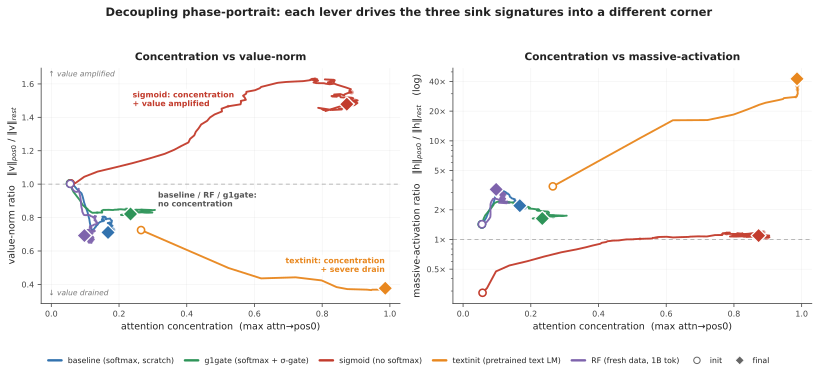
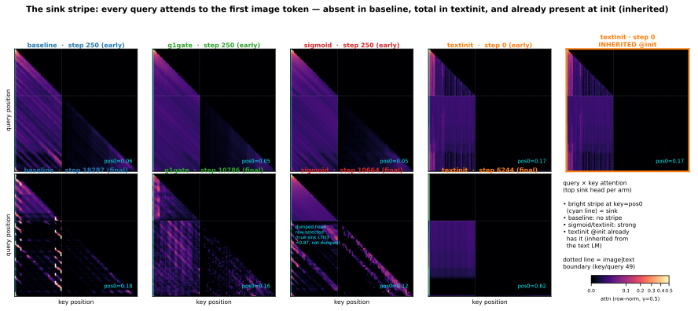
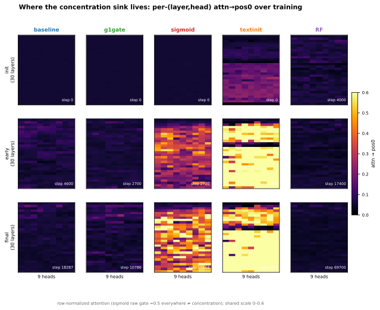
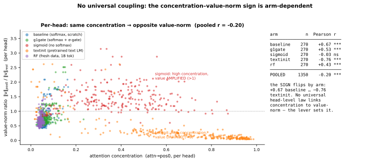
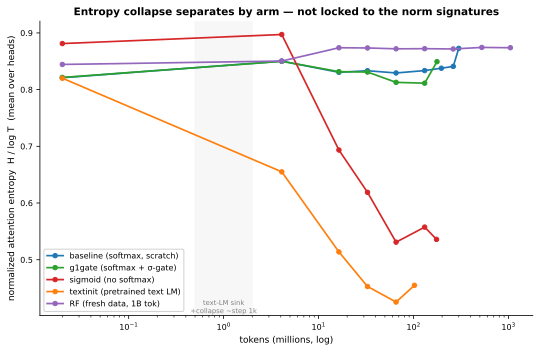

# Four Levers, Four Corners: Attention-Sink Signatures Dissociate in From-Scratch Vision–Language Pretraining

*Samvat Tiwari — July 2026 · Preprint draft v2*

---

Abstract.
Attention concentration on early tokens, near-zero value-vector norms at the attended token,
and massive residual-stream activations co-occur so reliably in trained language models that
they are often treated, implicitly, as facets of a single &ldquo;attention-sink&rdquo;
phenomenon. We test that reading in the one setting where the signatures can be watched
forming rather than inferred post hoc: from-scratch multimodal pretraining. We train a
222M-parameter vision&ndash;language model (a SigLIP-B/16 encoder feeding a randomly
initialized SmolLM2-135M-architecture decoder) under four training levers &mdash; standard
softmax attention, output-gated softmax, unnormalized sigmoid attention, and decoder
initialization from a pretrained text LM &mdash; and log the three signatures as separate
per-head quantities throughout training. The three signatures come apart. Across three
seeds, the four levers land in four distinct corners of (concentration &times; value-norm
&times; massive-activation) space: no two arms share a signature triple, and the value-norm
ratio alone is drained (0.38&ndash;0.72), unchanged (&asymp;1), or amplified
(1.48&ndash;1.60) depending on the lever. On a confound-free run over one billion
non-repeated tokens, massive activation grows +130% while attention concentration remains
exactly zero for the entire run. Per-head correlation between concentration and value-norm
flips sign across arms (+0.67 to &minus;0.76; pooled &minus;0.20), inconsistent with a
single mechanism driving both. Prior text-only work separates massive activations from
attention sinks; we show, for the first time in from-scratch multimodal pretraining, that
all three signatures &mdash; including value-norm drain as a third, independently moving
axis &mdash; are separately controllable by ordinary training-time choices.

---

# 1. Introduction

Decoder-only transformers develop a peculiar habit early in training: a disproportionate
share of attention mass concentrates on the first token(s) of the sequence, regardless of
content. This "attention sink" is not a curiosity — it is load-bearing for streaming
inference [12], complicates activation quantization through the extreme outliers that
accompany it [10], and has become a standing subject of interpretation and mitigation work
across modalities [13]. In text language models the sink arrives with company: attention
concentration, near-zero value-vector norms at the sink token ("value-state drain" [6]), and
abnormally large residual-stream activations ("massive activations" [10, 11]) have been
observed to emerge together — concentrating on the same few tokens [1] and co-emerging early
in training, by roughly step 1k [2]. Their consistent co-occurrence has led these signatures
to be treated, often implicitly, as facets of a single attention-sink phenomenon.

Whether they actually are one phenomenon is unsettled, and actively contested. One line of
work argues for genuine causal unity: massive activations in the residual stream
mathematically require representational compression, and ablating them eliminates both
compression valleys and sink formation [2]. A companion view holds that outlier-driven
rescaling by attention and residual sinks is *essential* to stable transformer training
[14]. Pulling the other way, two recent text-only studies dissociate pairs of these
signatures by intervention: normalization-scheme changes crush the massive-activation spike
while the sink ratio survives [3], and a value-scale intervention in from-scratch text LMs
preserves sinks while suppressing massive activations [4]. Each of these results is
text-only, and each separates at most two of the three signatures.

Vision–language models are a sharper instrument for this question than they might first
appear, for two reasons. First, the multimodal setting changes what position 0 *is*: in our
layout the sequence begins with 49 image tokens and there is no BOS — the candidate sink
token is a visual token, stripped of the special-token machinery that text-LM sink accounts
lean on. Second, existing multimodal sink studies analyze frozen, already-trained backbones
at inference time [7, 8]; they establish that vision-side and language-side sinks have
distinct origins, but a frozen model cannot answer an emergence question. Whether the three
signatures arise together, in sequence, or independently is only observable while they form
— which requires from-scratch pretraining with all three signatures logged separately,
densely, from step 0. To our knowledge no prior work does this in a multimodal model.

We do it at deliberately small scale: a 222M-parameter nanoVLM [18] — a pretrained
SigLIP-B/16 encoder [16] feeding a randomly initialized decoder with the SmolLM2-135M
architecture [17] — trained under four levers chosen to target one sink-relevant mechanism
each: standard softmax attention (*baseline*); a zero-initialized elementwise output gate on
attention, which in text LLMs removes both the sink and massive activations [5] (*g1gate*);
unnormalized sigmoid attention, which removes the softmax normalization that sinks are
argued to stem from [1] (*sigmoid*); and initializing the decoder from the pretrained
SmolLM2 text LM, importing whatever sink structure text pretraining built (*textinit*). A
validated probe logs concentration, value-norm ratio, and massive activation per (layer,
head) every 100 steps. Because the four-arm comparison reuses a small image pool at high
epoch counts, we additionally re-test the central negative result on a fresh, non-repeated
1-billion-token stream (*RF*), removing the overfitting confound.

**Contributions.**

1. **Four levers, four corners (n = 2–3 seeds/arm).** The four arms land in four distinct
   corners of (concentration × value-norm × massive-activation) space — no two arms share a
   signature triple, and the value-norm ratio alone moves in three qualitatively different
   directions (drained / unchanged / amplified) depending on the lever (Fig. 1, Table 2).
2. **Confound-free decoupling at 1B tokens.** On fresh data, massive activation rises +130%
   (h-ratio 1.43 → 3.22) over a full billion tokens while attention concentration stays at
   exactly zero for the entire run — 0% of heads ever cross the sink threshold (§4.2).
3. **No universal head-level coupling.** Per-head correlation between concentration and
   value-norm flips sign across arms (+0.67 baseline → −0.76 textinit; pooled −0.20),
   inconsistent with a single shared mechanism (§4.3).

We scope the novelty claim precisely: we are *not* the first to decouple sink signatures —
text-only work already separates massive activations from concentration via normalization
[3] and value-path [4] interventions. Our contribution is the conjunction: all three
signatures, including value-norm drain as a third independently moving axis, shown
separately controllable during from-scratch *multimodal* pretraining, a setting no prior
decoupling or co-emergence study has examined.

---

# 2. Setup

**Model and token layout.** All runs use a 222M-parameter nanoVLM [18]: a SigLIP-B/16
vision encoder [16] (pretrained, trainable) feeding a decoder with the SmolLM2-135M
architecture [17] through a learned modality projector. Except in the *textinit* arm, the
decoder trains **from random initialization** — the point is to watch sink signatures form,
not to probe a model that already has them. Sequences are 49 image tokens (a causal prefix)
followed by 79 left-padded text tokens, 128 total. **Position 0 is the first image token;
there is no BOS.** Any sink behavior at position 0 is therefore a property of the visual
prefix, not inherited BOS machinery.

**Arms.** Four training levers, each targeting one sink-relevant mechanism, with everything
else held byte-identical:

| arm | attention | LM init | ViT init | lever precedent |
|---|---|---|---|---|
| *baseline* | softmax | random | pretrained | — |
| *g1gate* | softmax + elementwise σ-gate (zero-init, post-SDPA) | random | pretrained | G1 gating [5] |
| *sigmoid* | unnormalized sigmoid, no softmax | random | pretrained | Gu et al. [1] |
| *textinit* | softmax | pretrained SmolLM2-135M | pretrained | — (novel control) |

The *g1gate* and *sigmoid* levers have established text-only sink effects [5, 1]; *textinit*
has no sink-literature precedent and acts as an inheritance control — it imports whatever
sink structure text pretraining already built into SmolLM2.

**Data, and the two training regimes.** The four-arm comparison trains on four curated
subsets of `the_cauldron` [19] (~146K images), matched at ~100M tokens/arm (60M for
*textinit*, which reaches its three-signature floor earlier; §4.1). Reusing a 146K-image
pool means high visual-epoch counts, so a "no sink emerges" reading could in principle be an
overfitting artifact. The **RF** run (random-fresh) therefore re-trains the *baseline* arm
on a fresh FineVision stream [20] (~4.6M natural images; 2.39 effective visual epochs at 1B
tokens vs. ~74 for the repeated pool) to 1B tokens. Swapping datasets trades the repetition
confound for a domain-shift confound, which we accept and document (the fresh pool is
natural-image, COCO-heavy, <3% overlap with the repeated subsets) rather than run a third,
domain-matched control (§5).

**Three signatures, tracked separately.** The three sink symptoms reported together in the
text-LM literature are logged as independent per-(layer, head) quantities, following the
metric conventions of Gu et al. [1] at fixed sequence length:

- **Concentration** — Sinkε1: the fraction of (layer, head) pairs
  whose *mean* attention to position 0 exceeds ε, plus mean/max attention→pos0. We use the
  ε = 0.3 default of [1] with robustness checks at ε ∈ {0.2, 0.4}; cross-arm tables report
  the stricter ε = 0.2, which makes absence claims *harder*, not easier, to pass.
- **Value-norm ratio** (v-ratio) — ‖v‖ at position 0 over the mean ‖v‖ of the remaining
  positions. Below 1 is value-drain [6]; above 1 is amplification.
- **Massive activation** (h-ratio) — residual-stream norm at position 0 over the rest.

All three are **pos0-anchored by construction.** This is a stated measurement choice, not a
silent assumption: at seed 0 we verified per-position attention *mass* directly, and
position 0 is the maximum-mass token in every arm (Appendix D); the residual seed-level
caveat is handled in §5. The *sigmoid* arm reports the row-normalized attention view so
concentration is comparable across arms (raw sigmoid mass is also logged).

**Probe.** `probe_sinks()` re-walks the decoder in eager/fp32/no-grad mode from the live
module weights, independent of the training path (fused SDPA kernels, autocast,
`torch.compile`). Every call validates its hidden states against the model's real forward
pass (relative error < 10⁻²), so the probe cannot silently drift from what the trained model
computes. The probe batch is fixed across all runs and seeds, making every number in this
paper comparable run-to-run. Probes fire every 100 optimizer steps — dense enough to
timestamp each signature's first threshold crossing (§4.4).

**Recipe.** AdamW (weight decay 0.1, following [1]), gradient clip 1.0, cosine schedule with
3% warmup (LM 4e-4, projector 2e-3, ViT 1e-4), bf16 autocast, `torch.compile`, batch size
128. Arms in a comparison differ only in the lever under test. Training is healthy in all
reported runs; on the 1B fresh run, held-out fresh validation loss falls 1.46 → 0.638,
tracking train loss with no overfit gap.

---

# 3. Results

<figure id="fig1">

<figcaption><b>Figure 1: Decoupling phase-portrait.</b> Training trajectories of every arm
in (concentration × value-norm) space (left) and (concentration × massive-activation) space
(right, log scale); circles mark initialization, diamonds the final checkpoint. Each lever
drives the three signatures into a distinct corner: <em>sigmoid</em> (red) reaches strong
concentration with value norms <em>amplified</em> and no massive activation;
<em>textinit</em> (orange) couples total concentration with severe value-drain and an
extreme massive activation; <em>baseline</em>/<em>g1gate</em>/<em>RF</em> (blue/green/purple)
never leave the no-concentration region while their massive activation grows. If the three
signatures were one phenomenon, these trajectories would co-move along a single direction;
instead every combination of directions occurs.</figcaption>
</figure>

## 3.1 Four training levers land in four distinct signature corners

Table 1 reports the three signatures for all four arms and all seeds (baseline/sigmoid
n = 2; g1gate/textinit n = 3), matched at ~100M tokens; *textinit* is read at 60M, where all
three of its signatures have plateaued (its h-ratio changes by less than 10% from 60M to
100M in the seeds that continued). Seed-0 values are trusted from a checksummed archive
rather than re-derived first-hand (§5).

**Table 1 — signature triple by arm, all seeds.** Sink^0.2 is the fraction of the model's
270 (layer, head) pairs whose mean attention→pos0 exceeds 0.2.

| arm | seed | tokens | Sink^0.2 | mean attn→pos0 | v-ratio | h-ratio |
|---|---|---|---|---|---|---|
| baseline | s0 | 101M | 0.000 | 0.068 | 0.723 | 2.16 |
| baseline | s1 | 100M | 0.000 | 0.062 | 0.687 | 1.71 |
| g1gate | s0 | 101M | 0.004 | 0.068 | 0.805 | 1.67 |
| g1gate | s1 | 100M | 0.011 | 0.073 | 0.845 | 2.04 |
| g1gate | s2 | 100M | 0.0037 | 0.072 | 0.854 | 2.24 |
| sigmoid | s0 | 102M | 0.830 | 0.377 | 1.479 | 1.10 |
| sigmoid | s1 | 100M | 0.756 | 0.311 | 1.603 | 1.30 |
| textinit | s0 | 60M | 0.852 | 0.627 | 0.377 | 42.5 |
| textinit | s1 | 60M | 0.556 | 0.235 | 0.634 | 5.50 |
| textinit | s2 | 60M | 0.578 | 0.232 | 0.484 | 12.2 |

Collapsing seeds to per-arm ranges (Table 2), **no two arms share a signature triple**, and
the value-norm axis alone takes three qualitatively different directions — drained below 1,
essentially unchanged at 1, and amplified above 1:

**Table 2 — the four corners.**

| arm | concentration | value-norm | massive activation |
|---|---|---|---|
| baseline | absent (0.000) | mild drain (0.69–0.72) | moderate (1.7–2.2) |
| g1gate | suppressed (0.004–0.011) | **neutral** (0.81–0.85) | moderate (1.7–2.2) |
| sigmoid | strong (0.76–0.83) | **amplified** (1.48–1.60) | none (1.1–1.3) |
| textinit | total (0.56–0.85) | strong drain (0.38–0.63) | extreme (5.5–42.5) |

The corners dissociate pairwise on single axes. *g1gate* separates from *baseline* purely on
value-norm — concentration is (near-)absent and massive activation moderate in both, but the
gate neutralizes the mild value-drain the baseline develops. *sigmoid* and *textinit* both
reach strong concentration yet separate on the *direction* of the value-norm effect
(amplified vs. drained) and on massive activation (none vs. extreme). A single training
lever moves one axis while leaving the others where a different lever put them — this is
what we mean by dissociation, and it is visible directly as the four trajectories of
Figure 1 fanning out from a common origin.

**Reproducibility differs by arm, and we report it.** *g1gate* is the tightest arm:
Sink^0.2 = 0.004/0.011/0.0037 across three seeds — at most 1% of heads — with mean and max
attention→pos0 flat across seeds. *baseline* and *sigmoid* (n = 2) are tight in both seeds.
*textinit*'s **corner is robust but its magnitudes are not**: all three seeds show high
concentration, strong value-drain, and h-ratio > 5, but seed 0 is the high outlier on every
signature simultaneously (Sink 0.85 vs. 0.56–0.58; mean attn→pos0 0.63 vs. 0.23; h-ratio
42.5 vs. 5.5–12.2), while seeds 1 and 2 track each other. The h-ratio has plateaued by
60–100M tokens in both lower seeds, so the spread is genuine seed sensitivity, not an
unconverged transient. We therefore report textinit's massive activation as a **range
(5.5–42.5×), median ≈ 12×**, everywhere in this paper, and treat the corner — not any
particular magnitude — as the reproducible claim.

## 3.2 Massive activation grows for 1B fresh tokens while concentration stays at zero

The four-arm comparison reuses a 146K-image pool at high epoch counts, so its "concentration
never emerges" reading could conceivably be an overfitting artifact. The RF run removes that
confound: the identical *baseline* recipe on a fresh, non-repeated FineVision stream to one
billion tokens (2.39 effective visual epochs).

**Concentration never arrives. Sink^0.3 = 0.000 across the entire 0 → 1B run** — its
maximum over the whole trajectory is 0.000; not one of the 270 heads crosses the sink
threshold at any probe, of ~700 probes. Massive activation, meanwhile, keeps growing far
past warmup:

**Table 3 — RF (fresh data, seed 0), init → 1B tokens.**

| signature | @ init | @ 1B | net |
|---|---|---|---|
| Sink^0.3 (concentration) | 0.000 | 0.000 | flat zero, entire run |
| max attn→pos0 | 0.056 | 0.098 | ≈flat, far below threshold |
| h-ratio (massive activation) | 1.43 | **3.22** | **+130%**, still rising at 1B |
| v-ratio (value-norm) | 1.00 | 0.69 | net drain, non-monotone |

The h-ratio rise is not a warmup artifact: it continues monotonically from 2.40 at ~57M
tokens to 3.22 at 1B, long after the 3% warmup window closes — the purple trajectory in
Figure 1 (right) climbs while never moving rightward. The v-ratio ends below its
initialization value, but ~75% of that drop occurs in the first 57M tokens and partially
recovers afterward, so we report it as supporting context rather than ongoing emergence.
The clean statement is the headline dissociation: **massive activation grows for a full
billion tokens of multimodal training while attention concentration never leaves zero.**

## 3.3 No universal head-level coupling between concentration and value-norm

If concentration and value-drain expressed one mechanism, their per-head correlation should
carry a consistent sign across training regimes. It does not. Pearson r between per-head
attention→pos0 and value-norm ratio at each arm's final checkpoint (n = 270 heads/arm;
scatter in Appendix Fig. A2):

**Table 4 — per-head r(attn→pos0, v-ratio), final checkpoint.** ***p < 0.001; ns = not
significant.

| baseline | g1gate | sigmoid | textinit | RF | pooled (n = 1350) |
|---|---|---|---|---|---|
| +0.67*** | +0.53*** | −0.03 ns | −0.76*** | +0.43*** | −0.20*** |

This is not a null cloud — individual arms show strong correlations — but the **sign is
arm-dependent**: heads that attend more to pos0 have *larger* value norms in the baseline
regime and *smaller* ones under text initialization. The pooled correlation is weak only
because opposite-signed arms cancel. A shared mechanism predicts a consistent sign; what we
observe is instead each lever inducing its own local relationship between the two axes.

## 3.4 Ordering: norm signatures lead, concentration is late, mirror-imaged, or never

<figure id="fig2">

<figcaption><b>Figure 2: Sink birth &amp; ordering.</b> <em>Top:</em> tokens at which each
signature first crosses a per-head threshold (massive-act h&gt;2, value-drain v&lt;0.8,
concentration attn→pos0&gt;0.3; log scale). In the softmax-from-scratch arms (baseline,
g1gate, RF) the norm signatures cross within the first ~4–50M tokens while concentration
never crosses (baseline, RF) or barely does (g1gate); <em>sigmoid</em> is the mirror image —
concentration crosses at ~6M tokens and the norm signatures never do; <em>textinit</em>
starts with value-drain already present at 0 tokens (inherited) and crosses concentration
before 1M. <em>Bottom:</em> birth-maps — the step at which each (layer, head) first crosses
the concentration threshold. 0% of baseline and RF heads ever cross; 1% of g1gate heads, vs.
89% (sigmoid) and 87% (textinit).</figcaption>
</figure>

Dense probing lets us timestamp each signature's arrival (Figure 2). The ordering is
consistent within arm families. In the softmax-from-scratch arms (*baseline*, *g1gate*,
*RF*), the norm signatures arrive early — massive activation crosses its per-head threshold
within the first few to ~15M tokens, value-drain follows within ~50M — while concentration
**never arrives**: 0% of baseline and RF heads ever cross the concentration threshold at any
point in training (g1gate: 1% of heads, a single-layer blip late in training). *sigmoid* is
the mirror image: concentration crosses early (~6M tokens; 89% of heads eventually cross)
while neither norm signature ever does. *textinit* inherits its signatures rather than
growing them — value-drain is present at 0 tokens, imported with the pretrained text-LM
weights, and concentration crosses before 1M tokens.

<figure id="fig3">

<figcaption><b>Figure 3: The sink stripe.</b> Query × key attention of the top sink head per
arm (row-normalized), early (top row) vs. final (bottom row); the cyan line marks key = pos0
and the dotted line the image|text boundary. The pos0 stripe is <em>absent</em> in baseline
throughout, <em>total</em> in textinit (attn→pos0 = 0.62 at its final checkpoint), and —
rightmost panel — <em>already present at step 0</em> in textinit, inherited from the text
LM. The sigmoid panel shows a head selected by raw (unnormalized) gate score rather than the
arm's true top sink head and understates sigmoid's concentration (annotation in panel); we
draw no claim about sigmoid from this figure — its concentration is established in Tables 1–2
and Figure 2.</figcaption>
</figure>

Figure 3 shows the same story at the single-head level: the query × key attention map of
each arm's top sink head. The vertical stripe at key = pos0 — every query attending to the
first image token — is absent in *baseline* at both the early and final checkpoint, total in
*textinit*, and, critically, **already present at step 0 in textinit**: the sink stripe is
imported with the text-LM weights before the model has seen a single image. We deliberately
draw no conclusion about *sigmoid* from this figure; the checkpoint dump selected its head
by an unnormalized gate score and missed the arm's true top sink head, so sigmoid's
concentration rests on Tables 1–2 and Figure 2 instead. Attention-entropy collapse — the
text-LM literature's usual concentration correlate — separates the same way: only *sigmoid*
and *textinit* collapse, while *baseline*, *g1gate*, and *RF* stay flat (Appendix Fig. A3).
Entropy collapse tracks the concentration axis, not the norm axes.

**A positional footnote.** In *textinit*, the three signatures partially decouple in
*position* as well as magnitude: in some seeds the most-attended token, the residual-norm
peak, and the value-drain minimum sit on three different tokens (e.g., attention at pos1
with the norm peak and drain at pos13). We report this as a caveat on where to anchor
textinit's magnitudes (§5), not as an independent finding.

---

# 4. Related Work

**Attention sinks and their companions in text LMs.** Gu et al. [1] give the canonical
empirical account: the sink token acts "more like key biases, storing extra attention
scores, which could be non-informative and not contribute to the value computation" — small
key/value norms at the sink are reported as part of the same phenomenon — and the sink is
connected to massive residual-stream activations [10, 11]. They also show that removing
softmax normalization (unnormalized sigmoid attention) prevents sink formation in text LMs
up to 1B parameters at near-zero validation-loss cost, the result our *sigmoid* arm builds
on. Guo et al. [6] describe the concentration/value-drain coupling as "active-dormant"
heads, the sink head's value state actively driven toward zero. Queipo-de-Llano, Arroyo et
al. [2] make the strongest unity claim, and the only genuinely *causal* one: massive
activations mathematically require representational compression, and ablating a model's
layer-0 massive activation eliminates both compression valleys and sink formation; across
Pythia checkpoints, sinks, compression valleys, and massive activations emerge together by
roughly step 1k and stay synchronized. We reserve "causally unified" for this result
specifically. Peng et al. [15] trace a first-position sink circuit emerging early in
from-scratch text pretraining — from-scratch emergence dynamics, text-only, without
signature decoupling.

**Prior decoupling results — text-only, two axes.** Two recent papers already separate
pairs of these signatures in text models, and our claim is scoped around them. Sun,
Canziani, LeCun & Zhu [3] show massive activations and attention sinks are dissociable
architectural artifacts: switching normalization scheme (Sandwich, DynamicTanh, QKNorm vs.
Pre-Norm) crushes the massive-activation spike while the sink ratio survives — a two-way
dissociation (massive activation vs. concentration), text-only, via a normalization lever,
on trained checkpoints. Chen & Yao [4] decouple the same pair from the opposite direction
and from scratch: in 0.1–0.3B text LMs probed at dense checkpoints, a value-scale
intervention preserves sinks while suppressing massive activations. Neither treats
value-norm drain as a third, independently moving axis; neither is multimodal. On the
opposite side of the argument, Qiu et al. [14] hold that outlier-driven rescaling by
attention and residual sinks is essential to stable training — the field is actively
unsettled on whether these signatures are separable, and on whether they should be removed
at all.

**Multimodal sinks — frozen backbones, inference time.** Luo et al. [7] identify high-norm
attention-sink tokens originating in the ViT and separate ViT-propagated from LLM-emerged
sinks; Choi et al. [8] likewise distinguish vision-sinks from language-sinks in a frozen
LVLM and gate them layer-wise. Both establish that multimodal sinks have distinct vision-
and language-side origins — a frame our *textinit* inheritance result fits naturally — but
both analyze already-trained models, so neither can observe emergence, and neither measures
the three signatures as separate quantities. Relatedly, vision transformers grow high-norm
"register" tokens of their own [9], which is why our pretrained encoder is a stated
limitation (§5) rather than a footnote.

**The gating lever.** Qiu et al. [5] introduce the head-specific, zero-initialized
elementwise sigmoid gate on attention output that our *g1gate* arm uses; in text LLMs it
"largely reduces the attention score allocated to the first token and decreases massive
activations" while improving quality. Our finding sharpens what the gate does in the
multimodal from-scratch setting: with concentration already absent in the baseline, the
gate's isolated, reproducible effect is to *neutralize value-drain* (v-ratio 0.81–0.85 vs.
baseline 0.69–0.72) while leaving massive activation untouched — an effect invisible unless
the three signatures are logged separately.

**Positioning.** The closest prior work separates at most two of the three axes, in
text-only models, via normalization or value-path interventions. The multimodal studies
analyze frozen models. We are aware of no study that tracks concentration, value-norm, and
massive activation as independently measured quantities across from-scratch multimodal
pretraining. Accordingly: we claim to be **first to show all three sink signatures
independently controllable during from-scratch multimodal pretraining, adding value-norm
drain as a third axis** beyond the massive-activation-vs-sink dissociations shown in text
models [3, 4] — and we do not claim to be first to decouple sink signatures in general.

---

# 5. Limitations

**Pos0-anchored metrics.** All three signatures are measured at the first image token. We
verified this anchoring first-hand at seed 0 by per-position attention *mass* (not just
argmax): position 0 is the maximum-mass token in every arm — baseline 0.06 mean / 0.17
max-head, g1gate 0.07 / 0.23, sigmoid 0.30 / 0.66, and textinit 0.63 / 0.99 with the
next-highest position at 0.009 (Appendix D). That validates the reported seed-0 magnitudes,
including textinit's h-ratio of 42.5. It does not close the question at seeds 1–2:
live-probe argmax data there shows the most-attended position can migrate off pos0 in
*textinit* (one seed splits across pos1 and pos13), so part of textinit's cross-seed
magnitude spread may be position migration rather than pure magnitude noise. This is one
more reason we report textinit as a range/median and treat its corner, not its magnitudes,
as the claim. A full per-position value/residual-norm scan across all seeds is left to a
camera-ready revision.

**Pretrained vision encoder.** The SigLIP encoder is pretrained, so no arm is fully from
scratch — only the decoder is. ViTs grow high-norm register tokens of their own [9], and
sinks can propagate from a ViT into an LVLM [7], so part of our massive-activation signal
could in principle be inherited rather than decoder-formed. Our defense is the trajectory:
h-ratio starts at 1.0–1.4 at initialization and *rises* through training (RF: 1.43 → 3.22
over 1B tokens); pure inheritance from a static encoder predicts a high, flat h-ratio from
step 0. A random-initialized-ViT control, isolating the decoder entirely, is future work.

**Token scale.** Runs reach at most 1B tokens per arm, versus the ~5B canonical in the
text-LM sink literature [1]. Sink emergence is early relative to that budget — text-LM
sinks and their companions form by roughly step 1k [2], far inside our range — but we
cannot rule out that a signature absent at 1B emerges later. Larger-scale confirmation is
future work.

**Textinit magnitude reproducibility.** The *textinit* massive activation is seed-sensitive
(h-ratio 5.5–42.5 across three seeds; seed 0 the consistent outlier on every signature).
The corner — high concentration + strong drain + large massive activation — is the
reproducible claim; no specific magnitude is.

**Provenance and seed count.** Seed-0 raw probes for the four-arm comparison are trusted
from a checksummed archive summary, not re-derived first-hand; seeds 1–2 *were*
independently re-derived, and that audit caught and corrected a metric-labeling error in an
earlier internal consolidation (mean vs. max attention mixed in one column), which is why
we report the metrics like-for-like here. *baseline* and *sigmoid* have two seeds; *g1gate*
and *textinit* three. The RF run is a **single seed**, and contains one OOM-forced,
weights-only resume at ~57M tokens; the audit verified signature continuity across the seam
(identical v/h values at the shared checkpoint; a double-covered 600-step overlap diverging
within probe noise; concentration 0.000 on both sides), and the decoupling movement
completes before the seam. Concentration was reproducibly zero across both seeds of the
repeated-data baseline, which we take as adequate support for the negative claim; a second
fresh-data seed would strengthen it.

**Domain shift in the fresh-data control.** RF removes the repetition confound (~74 visual
epochs → 2.39) by switching datasets, introducing a domain-shift confound in its place. We
accepted this trade deliberately — repetition is the dominant confound, and the fresh pool
was chosen to minimize shift (natural-image, COCO-heavy, <3% overlap) — and note that the
no-sink result held in both the stronger- and weaker-shuffle regimes of the stream. A
domain-matched fresh-and-repeated control is the known follow-up.

**No benchmark accuracy is reported.** We measure sink signatures with the probe of §2. We
did not run downstream benchmark evaluation (e.g., MMStar) on any arm, and we make no claim
about how signature dissociation relates to downstream capability.

---

# 6. Conclusion

We tracked the three signatures commonly bundled as "the attention sink" — concentration,
value-norm drain, and massive activation — as separate quantities across from-scratch
multimodal pretraining, and they came apart everywhere we looked. Four training levers
produced four distinct signature corners, with the value-norm axis alone moving in three
different directions; on a confound-free billion-token fresh-data run, massive activation
grew +130% while concentration never left zero; per-head correlation between concentration
and value-norm flipped sign across arms; and the signatures arrived in different orders —
norms first and concentration never in the softmax-scratch arms, the mirror image under
sigmoid attention, and everything at once, inherited at step 0, under text initialization.

None of this shows the signatures are unrelated in general: text-LM work documents real
interactions among them, including a causal route from massive activations to sinks and
compression valleys [2]. What it shows is that the coupling is not obligatory — in
from-scratch multimodal pretraining, each axis can be moved independently by ordinary
training-time choices, extending the two-way text-only dissociations [3, 4] to a third axis
and a new setting. The practical corollary for interpretability and mitigation work is that
treating any one signature as a proxy for the others is unsafe: a model with no attention
sink can still carry a growing massive activation, and a gate that removes value-drain may
leave everything else untouched.

**Next steps.** A random-initialized vision encoder to isolate the decoder's contribution
to massive activation; a per-position norm scan across all seeds to close the remaining
anchoring caveat on the text-initialized arm; and extending the fresh-data run past 1B
tokens to match text-LM budgets.

**Reproducibility.** All signatures are computed by a self-validating probe (§2) on a fixed
probe batch, from dense (every-100-step) logs; per-seed tables are in the Appendix. Code,
probe, run configurations, and checkpoints will be released with the paper.

---

# References

[1] X. Gu, T. Pang, C. Du, Q. Liu, F. Zhang, C. Du, Y. Wang, M. Lin. *When Attention Sink
Emerges in Language Models: An Empirical View.* ICLR 2025. arXiv:2410.10781.

[2] N. Queipo-de-Llano, D. Arroyo, F. Barbero, Y. Dong, M. Bronstein, Y. LeCun,
R. Shwartz-Ziv. *Attention Sinks and Compression Valleys in LLMs are Two Sides of the Same
Coin.* arXiv:2510.06477, 2025.

[3] M. Sun, A. Canziani, Y. LeCun, C. Zhu. *The Spike, the Sparse and the Sink: Anatomy of
Massive Activations and Attention Sinks.* arXiv:2603.05498, 2026.

[4] Y. Chen, Z. Yao. *Attention Sinks Induce Gradient Sinks.* arXiv:2603.17771, 2026.

[5] Z. Qiu et al. *Gated Attention for Large Language Models: Non-linearity, Sparsity, and
Attention-Sink-Free.* NeurIPS 2025. arXiv:2505.06708.

[6] T. Guo et al. *Active-Dormant Attention Heads: Mechanistically Demystifying
Extreme-Token Phenomena in LLMs.* 2024. [citation to verify]

[7] Y. Luo et al. *To Sink or Not to Sink: Visual Information Pathways in LVLMs.*
arXiv:2510.08510, 2025.

[8] S. Choi et al. *When Sinks Help or Hurt: Layer-wise Sink Gating in Large Vision-Language
Models.* arXiv:2604.03316, 2026. [title to verify]

[9] T. Darcet, M. Oquab, J. Mairal, P. Bojanowski. *Vision Transformers Need Registers.*
ICLR 2024. [arXiv ID to verify: 2309.16588]

[10] M. Sun, X. Chen, J. Z. Kolter, Z. Liu. *Massive Activations in Large Language Models.*
2024. [arXiv ID to verify: 2402.17762]

[11] N. Cancedda. *Spectral Filters, Dark Signals, and Attention Sinks.* 2024.
[citation to verify]

[12] G. Xiao, Y. Tian, B. Chen, S. Han, M. Lewis. *Efficient Streaming Language Models with
Attention Sinks.* ICLR 2024. [arXiv ID to verify: 2309.17453]

[13] Y. Su et al. *Attention Sink in Transformers: A Survey.* arXiv:2604.10098, 2026.

[14] Z. Qiu et al. *A Unified View of Attention and Residual Sinks: Outlier-Driven Rescaling
is Essential for Transformer Training.* arXiv:2601.22966, 2026.

[15] J. Peng et al. *How Attention Sinks Emerge in Language Models: An Interpretability
Perspective.* arXiv:2603.06591, 2026.

[16] X. Zhai, B. Mustafa, A. Kolesnikov, L. Beyer. *Sigmoid Loss for Language Image
Pre-Training (SigLIP).* ICCV 2023. [arXiv ID to verify: 2303.15343]

[17] L. Ben Allal et al. *SmolLM2: When Smol Goes Big — Data-Centric Training of a Small
Language Model.* 2025. [citation to verify]

[18] L. Wiedmann, A. Kaddour et al. *nanoVLM.* Hugging Face, 2025.
[citation form to verify]

[19] H. Laurençon, L. Tronchon, M. Cord, V. Sanh. *What Matters When Building
Vision-Language Models? (Idefics2 / The Cauldron).* 2024.
[arXiv ID to verify: 2405.02246]

[20] *FineVision* dataset. Hugging Face, 2025. [citation to verify]

---

# Appendix

## A. Supporting figures

<figure id="figA1">

<figcaption><b>Figure A1: Where concentration lives in the network.</b> Per-(layer, head)
attention→pos0 over training (row-normalized). baseline and RF stay cold throughout;
textinit is hot from initialization; sigmoid lights up a band of mid-network layers.</figcaption>
</figure>

<figure id="figA2">

<figcaption><b>Figure A2: No universal head-level coupling.</b> Per-(layer, head)
concentration vs. value-norm ratio at the final checkpoint, by arm (n = 270/arm). The
correlation sign flips by arm (+0.67 baseline … −0.76 textinit; Table 4); the pooled cloud
is weak (−0.20) only because opposite-signed arms cancel. This should not be read as an
uncorrelated cloud — most individual arms show strong |r|.</figcaption>
</figure>

<figure id="figA3">

<figcaption><b>Figure A3: Entropy collapse tracks concentration only.</b> Attention entropy
over training: only sigmoid and textinit collapse; baseline, g1gate, and RF stay flat —
the entropy-collapse correlate from the text-LM literature follows the concentration axis,
not the norm axes.</figcaption>
</figure>

## B. Full per-seed signature table

Reproduces Table 1 with max attention→pos0 where available. This metric was logged for
seeds 1–2 only (the seed-0 archive summary does not include it), so it is kept out of the
main comparative table.

| arm | seed | tokens | Sink^0.2 | mean attn→pos0 | max attn→pos0 | v-ratio | h-ratio |
|---|---|---|---|---|---|---|---|
| baseline | s0 | 101M | 0.000 | 0.068 | — | 0.723 | 2.16 |
| baseline | s1 | 100M | 0.000 | 0.062 | — | 0.687 | 1.71 |
| g1gate | s0 | 101M | 0.004 | 0.068 | — | 0.805 | 1.67 |
| g1gate | s1 | 100M | 0.011 | 0.073 | ~0.21 | 0.845 | 2.04 |
| g1gate | s2 | 100M | 0.0037 | 0.072 | ~0.22 | 0.854 | 2.24 |
| sigmoid | s0 | 102M | 0.830 | 0.377 | — | 1.479 | 1.10 |
| sigmoid | s1 | 100M | 0.756 | 0.311 | — | 1.603 | 1.30 |
| textinit | s0 | 60M | 0.852 | 0.627 | — | 0.377 | 42.5 |
| textinit | s1 | 60M | 0.556 | 0.235 | ~0.53 | 0.634 | 5.50 |
| textinit | s2 | 60M | 0.578 | 0.232 | ~0.59 | 0.484 | 12.2 |

Note on g1gate: both seeds with max-attention data show a single head at ~0.21–0.22 max
attention→pos0 while the arm mean stays ~0.07 and Sink^0.2 stays ≪ 0.05 — reproducible
across seeds, and below every sink threshold used in this paper.

## C. Per-position attention mass (seed 0)

Mean and max-head attention mass by position at seed 0, confirming position 0 is the
maximum-mass token — by mass, not merely argmax count — in every arm. This is the direct
check behind the pos0-anchoring defense of §5.

| arm | mass@pos0 (mean) | max-head@pos0 | argmax-mass position | reading |
|---|---|---|---|---|
| baseline | 0.06 | 0.17 | 0 | pos0 max; diffuse (no sink) |
| g1gate | 0.07 | 0.23 | 0 | pos0 max; diffuse |
| sigmoid | 0.30 | 0.66 | 0 | pos0 max; broad raw-sigmoid mass |
| textinit | 0.63 | 0.99 | 0 | pos0 max; razor spike (pos1 = 0.009) |

Per-position **mass** profiles for seeds 1–2 and RF were not available at the time of
writing (they require a checkpoint re-dump on GPU); only live-probe argmax data exists
there, and it is the source of the textinit position-migration caveat in §5.

## D. Notes on metric hygiene

Two corrections made during the audit of this paper's numbers, recorded for transparency:
(i) an earlier internal consolidation mixed two metrics (mean vs. max attention→pos0) in a
single column, manufacturing an apparent seed anomaly in *g1gate*; re-derived
like-for-like, the anomaly disappears and g1gate is the most reproducible arm.
(ii) An earlier draft claim that textinit's residual-norm peak "stays pinned at pos0" was
checked against the norm dump and found wrong — the ‖h‖ peak sits at pos1 or pos13
depending on seed, which is the positional-decoupling footnote of §3.4, stated there in
its corrected form.
